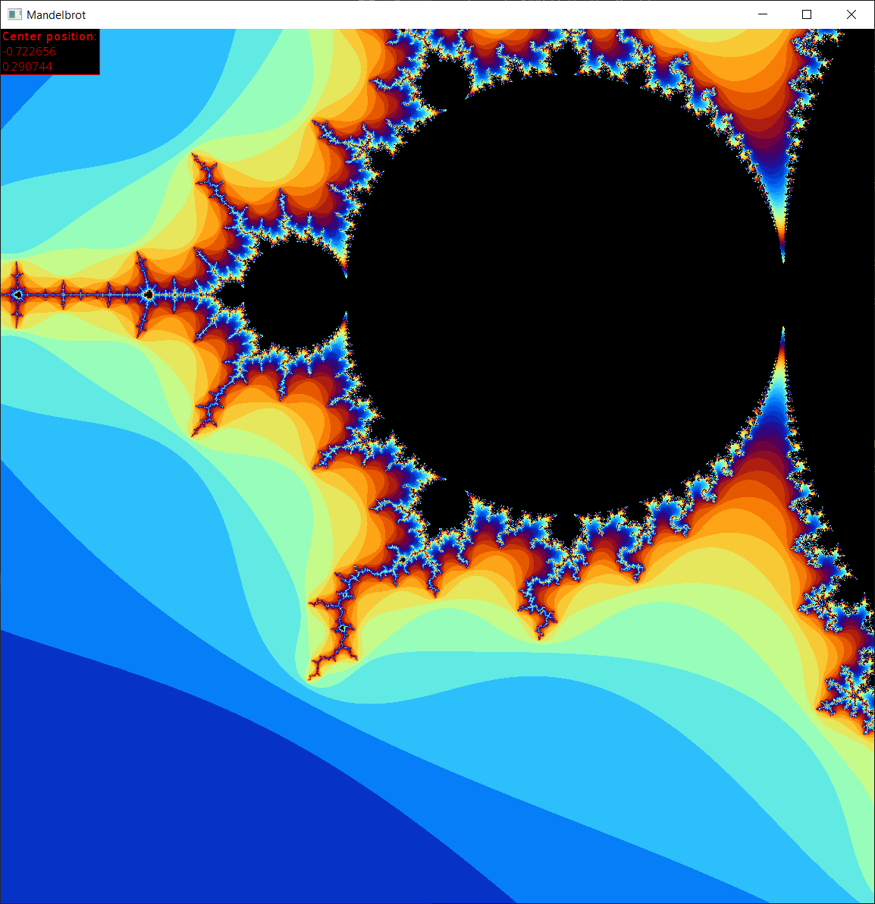
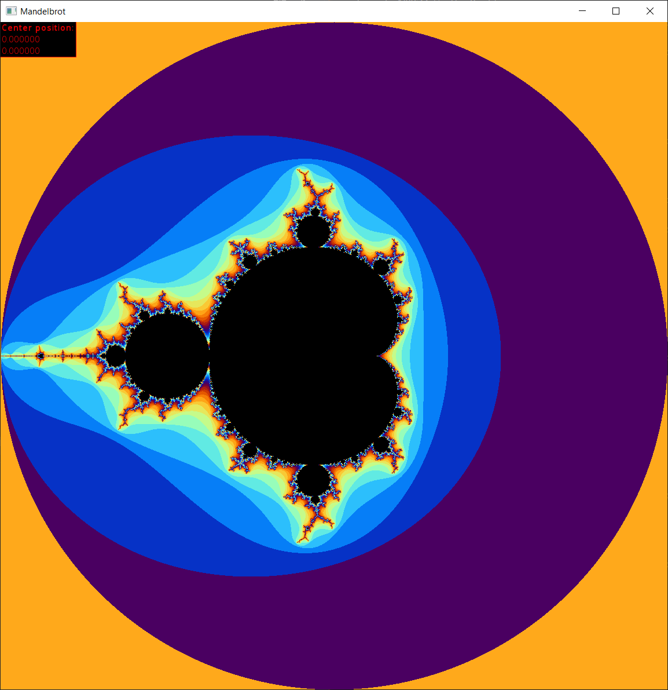
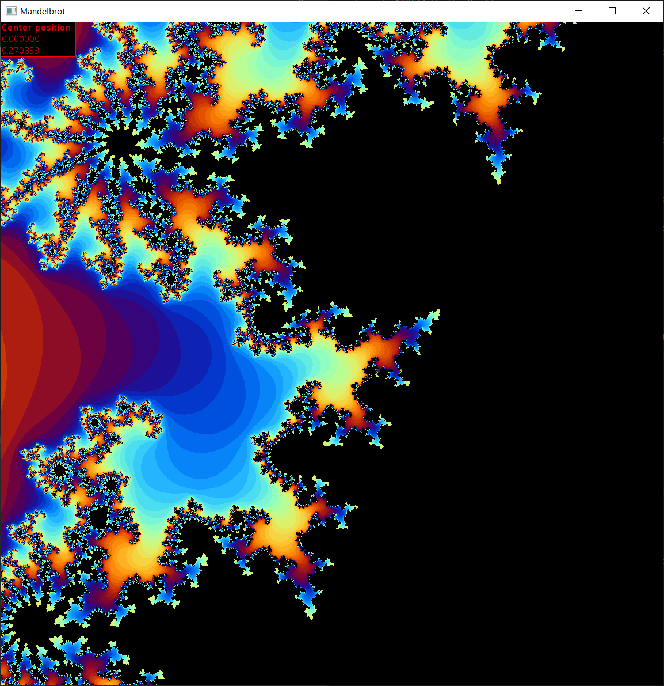
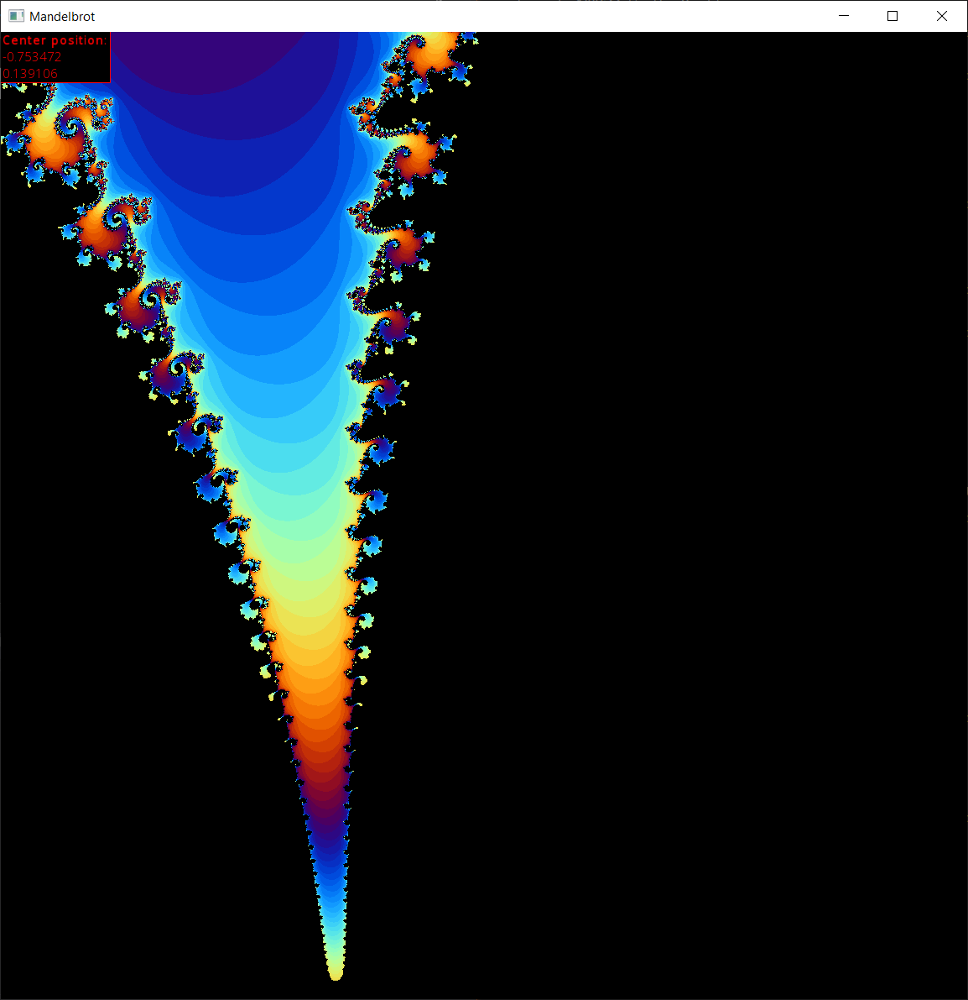

# Mandelbrot wiewer

Developed with SFML.

Let's user explore the mandelbrot set.

Scrolling or UP/Down zooms in and out.

By clicking a point, you set the center coordinates, where the zoom will center.

Press S to save current image to .png.

Kent Odde, May 2019

##### More screenshots:

